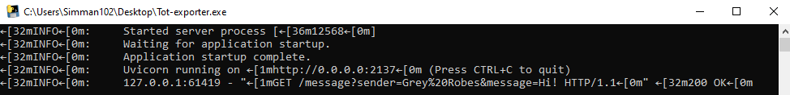
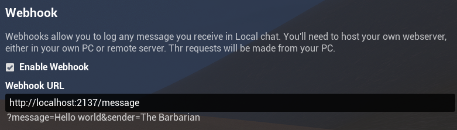
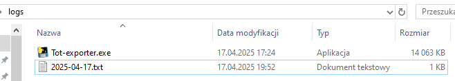

# Tot-exporter
## Usage
### Standard (RECOMMENDED)
1. Download the most recent release
2. Run Tot-exporter.exe (decline any firewall popups, this does not need Internet access)

    This is the window that'll appear. Logs will continue to save as long as you keep it open.
3. Enable webhooks in Tot and set the address to `http://localhost:2137/message`

    

4. Local chat messages will be exported to files, named `<year-month-day>.txt`, located within the same directory as the `.exe` file. This will always assume UTC timezone.

### python
1. Install [python](https://www.python.org/)
2. Navigate to src
3. Install dependencies by `pip install -r requirements.txt`
4. Run it via `py Tot-exporter.py`